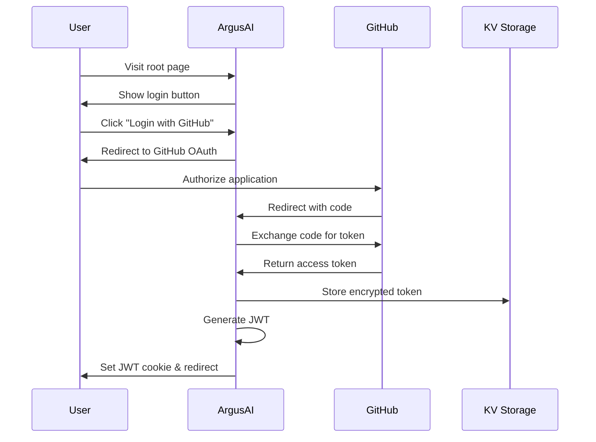

# GitHub OAuth Authentication Architecture

## Overview

This document describes the OAuth authentication system for ArgusAI, allowing users to log in with their GitHub account and manage repository configurations.

## Architecture Components

### 1. OAuth Flow



### 2. Data Storage

#### KV Namespaces

**OAUTH_SESSIONS**
- Key: `session:{session_id}`
- Value: JWT token data
- TTL: 7 days

**OAUTH_TOKENS**
- Key: `token:{user_id}`
- Value: Encrypted GitHub access token
- TTL: None (manual rotation)

**CONFIG (existing)**
- Key: `user:{github_id}:repos`
- Value: User's enabled repositories

### 3. Security Measures

1. **CSRF Protection**: Random state parameter validated on callback
2. **Token Encryption**: AES-256-GCM encryption for stored tokens
3. **JWT Security**: HS256 signed with environment secret
4. **HTTPOnly Cookies**: JWT stored in secure, httpOnly cookie
5. **Rate Limiting**: Per-user OAuth attempt limits

### 4. API Endpoints

#### Authentication Endpoints
- `GET /auth/login` - Initiate OAuth flow
- `GET /auth/callback` - Handle OAuth callback
- `POST /auth/logout` - Clear session
- `GET /auth/user` - Get current user info

#### Protected Endpoints
- `GET /api/user/repos` - List user's repositories
- `POST /api/user/repos/{owner}/{repo}/enable` - Enable ArgusAI
- `DELETE /api/user/repos/{owner}/{repo}/enable` - Disable ArgusAI

### 5. JWT Payload Structure

```typescript
interface JWTPayload {
  sub: string;        // GitHub user ID
  login: string;      // GitHub username
  name: string;       // User's display name
  avatar_url: string; // Avatar URL
  iat: number;        // Issued at
  exp: number;        // Expiration (7 days)
}
```

### 6. Environment Variables

New variables needed:
- `GITHUB_OAUTH_CLIENT_ID` - OAuth App client ID
- `GITHUB_OAUTH_CLIENT_SECRET` - OAuth App client secret
- `JWT_SECRET` - Secret for signing JWTs
- `ENCRYPTION_KEY` - Key for encrypting stored tokens

### 7. UI Changes

#### Root Page (/)
- Add "Login with GitHub" button when not authenticated
- Show user avatar and dropdown when authenticated
- Display list of configured repositories

#### Repository Management UI
- Table showing all user repositories
- Toggle switches to enable/disable ArgusAI
- Repository status indicators

### 8. Migration Strategy

1. OAuth App runs alongside existing GitHub App
2. Users can optionally authenticate for management features
3. Webhook processing continues using GitHub App authentication
4. No disruption to existing functionality

## Implementation Phases

1. **Phase 1**: Basic OAuth flow and JWT generation
2. **Phase 2**: Repository listing and management API
3. **Phase 3**: UI updates with login and repo management
4. **Phase 4**: Enhanced features (bulk operations, search, filters)

## Error Handling

- Invalid OAuth state: Show error page with retry option
- GitHub API errors: Graceful degradation with cached data
- Token expiration: Automatic refresh or re-authentication
- Rate limits: Show remaining quota and retry time